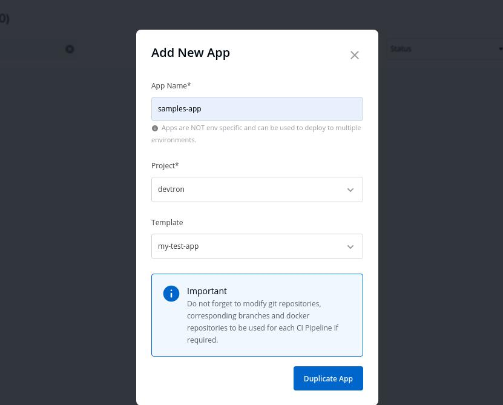
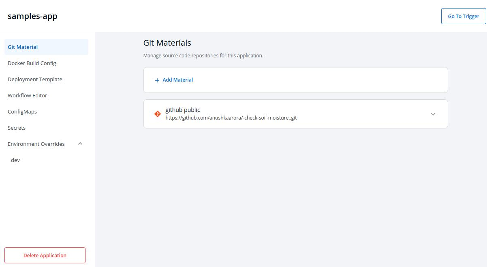

# Cloning Application

Select `Add New App` to Create a new app.

| Key | Description |
| :--- | :--- |
| `App Name` | Name of the new app you want to Create |
| `Project` | Project name |
| `Template` | Select the App whose template you want to use to the Create new app |

Click on `Duplicate App` to create App with a template of the Application you have selected from the Drop-down.

New application with a duplicate template is created.

