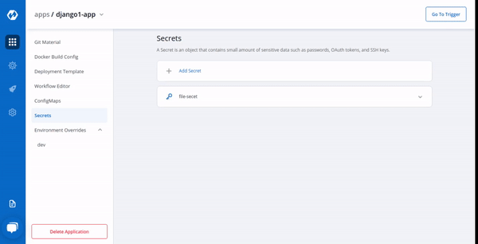

+++
bookCollapseSection = false
title = "Secrets"
description = ""
weight = 6
+++

Secret objects lets you store and manage sensitive information, such as passwords, Auth tokens, and ssh keys. Embedding this information in a secret is safer and more flexible than putting it verbatim in a Pod definition or in a container image.

&nbsp;&nbsp;



Click on `Add Secret` to add a new secret.

 

### Configure Secret

 



&nbsp;&nbsp;

Key | Description
----|----
`Name` | Name of the Secret
`Data Type` | Data Type of the Secret, To know about different Data Types available Click on: [Data Types](https://docs.devtron.ai/docs/reference/creating-application/secrets/#data-types)
`Data Volume` | Specify, if there is a volume that is accessible to Containers running in a pod needs to be added
`Environment Variable` | Select if there are Environment Variables to be injected in pods
`Key` | Key
`Value` | Value for a given key

 

### Data Types

There are namely five Data types, that you can use to save your secret.

* ***Kubernetes Secret*** : The secret that you create using Devtron.

* ***Kubernetes External Secret*** : The secret data of your application is fetched externally, converts the Kubernetes External Secret to Kubernetes Secret. The conversion is completely transparent to Pods and secrets are accessed normally.

* ***AWS Secret Manager*** : The secret data of your application is fetched from AWS Secret Manager, converts AWS Secret to Kubernetes Secret. The conversion is completely transparent to Pods that can access secrets normally.

* ***AWS System Manager*** : The secret data for your application is fetched from AWS Secret Manager, converts the secrets stored in AWS System Manager to Kubernetes Secret. The conversion is completely transparent to Pods that can access secrets normally.

* ***Harshi Corp Vault*** : The secret data for your application is fetched from AWS Secret Manager, converts the secrets stored in Harshi Corp Vault to Kubernetes Secret. The conversion is completely transparent to Pods that can access secrets normally.

 

### Volume Mount Path

Specify Volume Mount folder path in `Volume Mount Path`, path where the data volume needs to be mounted, which will be accessible to the Containers running in a pod.

&nbsp;&nbsp;



&nbsp;&nbsp;

Click on `Save Secret` to save the secret.

&nbsp;&nbsp;



 

You can see the Secret is added.

&nbsp;&nbsp;

