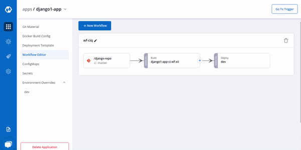

# Workflow

Workflow is a logical sequenece of different stages used for continous integration and continous deployment of an application.

Click on `Create Workflow` to create a new workflow

Enter the name of your workflow and then Click on `Add Workflow` to add a new workflow. Workflow always starts from [Git Material](../git-material.md).

Then, Create CI/CD Pipelines for your application.

To know how to Create the CI Pipeline for your application Click On: [Create CI Pipelines](ci-pipeline.md)

To know how to Create the CD Pipeline for your application Click On: [Create CD Pipelines](cd-pipeline.md)

