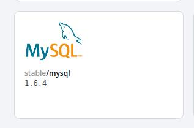
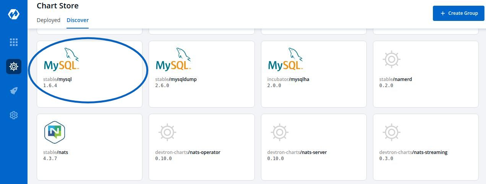
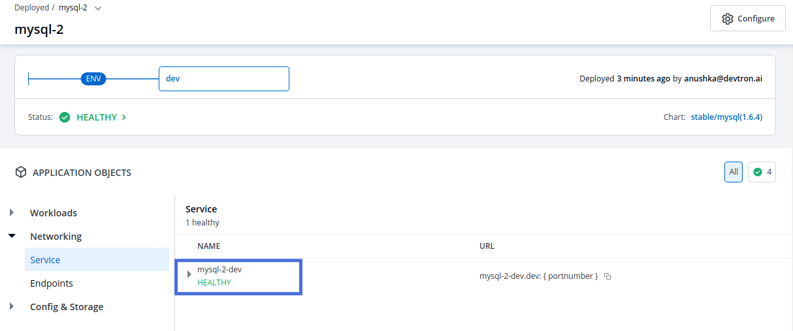

# Deploying Mysql Helm Chart

### Introduction

stable/mysql Helm chart bootstraps a single node MySQL deployment on a Kubernetes cluster using the Helm package manager.

### 1. Discover the chart from the Chart Store

Select the `Charts` section from the left pane, you will be landed to the `Chart Store` page. Click on `Discover` and find `stable/mongodb-replicaset` Helm Chart.

### 2. Configure the Chart

After selecting the stable/mySQL Helm chart, click on `Deploy`

Enter the following details, to deploy mysql chart:

| Key | Description |
| :--- | :--- |
| `App Name` | Name of the Chart |
| `Project` | Select the name of your Project in which you want to deploy the chart |
| `Environment` | Select the environment in which you want to deploy the chart |
| `Chart Version` | Select the latest Chart Version |
| `Chart Value` | Select the latest default value or create a custom value |

#### Configure `values.yaml`

Set the following parameters in the chart, to be later used to connect mysql with your Django Application.

| Parameters | Description |
| :--- | :--- |
| `mysqlRootPassword` | Password for the root user. Ignored if existing secret is provided |
| `mysqlDatabase` | Name of your mysql database |
| `mysqluser` | Username of new user to create |
| `mysqlPassword` | Password for the new user. Ignored if existing secret is provided |

Click on `Deploy` to deploy the Chart

### 3. Check the Status of Deployment

After clicking on `Deploy` you will land on a page, that shows the Status of the deployment of the Chart.

The Status of the chart should be `Healthy`. It might take few seconds after initiating the deployment of the chart.

In case the Status, of the deployment is `Degraded` or takes a long time to get deployed.

Click on the `Status` or check the logs of the pods to debug the issue.

### 4. Extract the Service Name

Copy the service name, it will be used to connect your application to mySQL.

