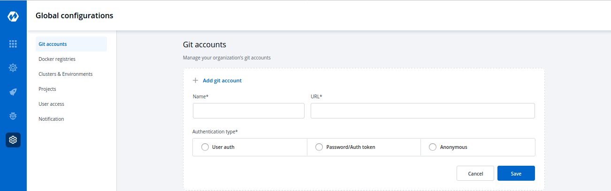
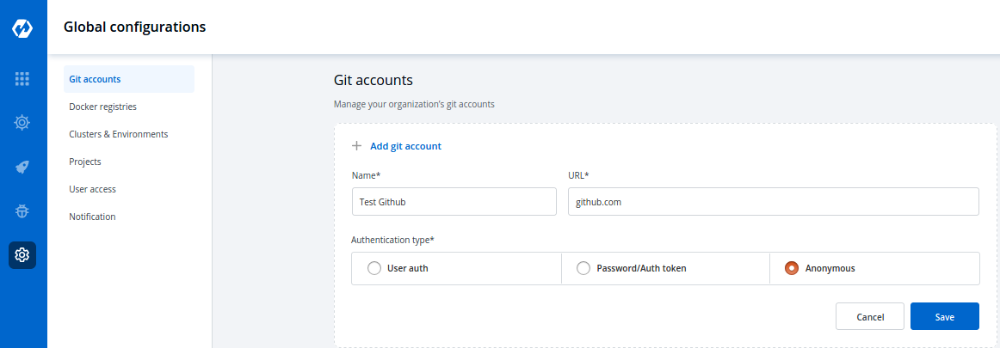
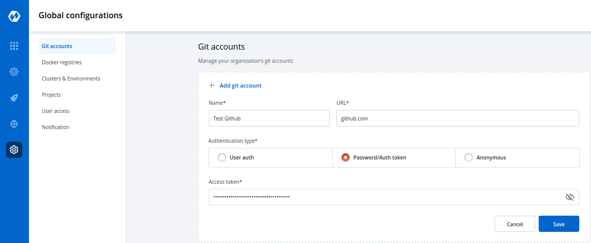
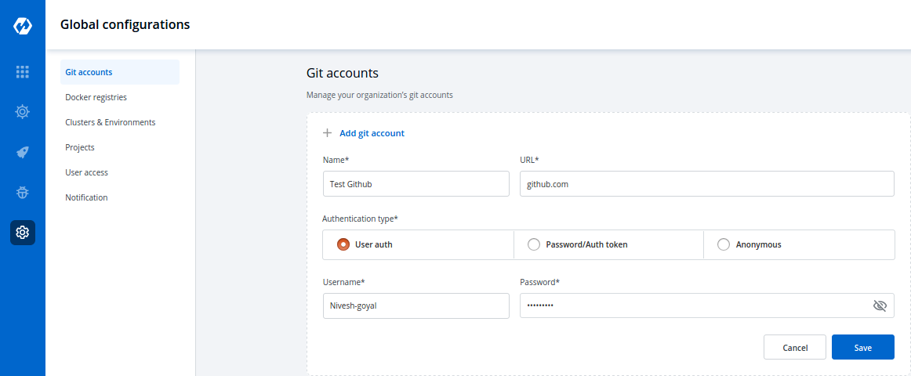
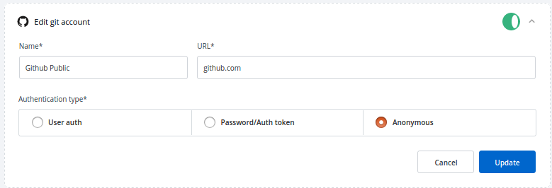
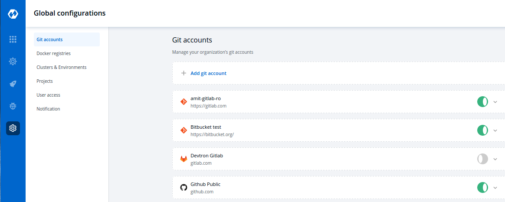

# Git Accounts

Glocal configurations are used to configure your Git Providers, Docker Registry, Kubernetes clusters, different environments, User Management, and different Notifications for your application. We have segregated all the configurations and we will discuss how to configure all these one by one.

### Git Account Configuration

`Global Configuration` helps you add a Git provider. Click on `Add git account` to add a new git provider and provide three inputs as below.

1. Name
2. URL
3. Authentication type

* Anonymous
* Password/Auth token
* User auth

#### 1. Name

Provide a name to your Git provider. This will be added as one option in the Git Provider drop-down inside the Git Material section.

#### 2. URL

Provide the `URL` of your Version Controller. **For example**- github.com for Github, [https://gitlab.com](https://gitlab.com) for GitLab, etc.

#### 3. Authentication type

Here you have to provide the type of Authentication required by your version controller. We are supporting three types of authentications, you can choose any one from them.

* **Anonymous**

If you select `Anonymous` then you do not have to provide any username, password, and authentication token. Just click on `Save` to save your git account provider details. 

* **Password/Auth token**

If you select Password/Auth token then you have to provide the `Access token` for the authentication of your version controller account inside the Access token box. Click on `Save` to save your git account provider details.

* **User auth**

If you choose `User auth` then you have to provide the `Username` and `Password` of your version controller account. Click on `Save` to save your git account provider details.

### Update Git Account

You can update your saved git account settings at any point in time. Click on the git account which you want to update. Make changes and click on \`Update to save you changes.

#### Note:

You can enable and disable your git account setting. If you enable it, then you are able to see the git account in the drop-down of Git provider.

