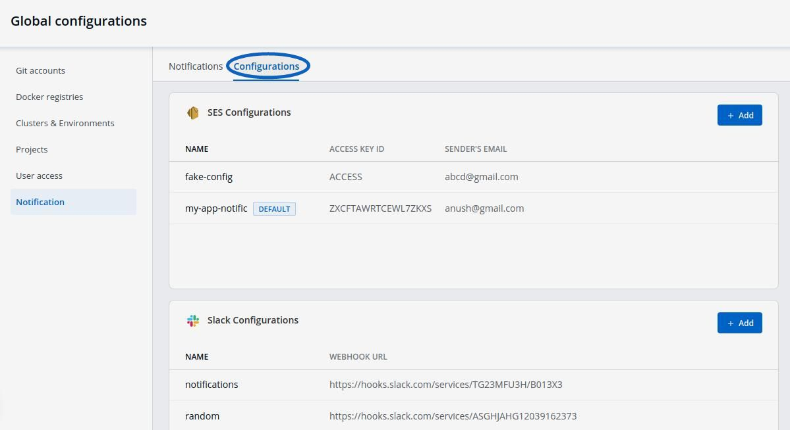
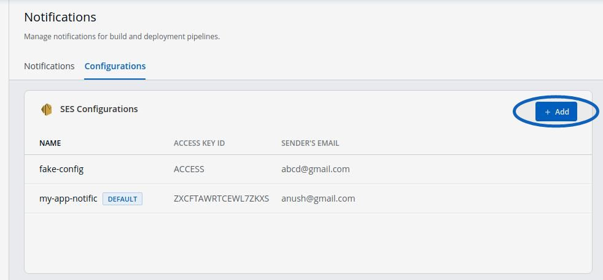

# Configure Notifications

This feature helps you manage the notifications for your build and deployment pipelines. You can receive the notifications on Slack or via e-mail.

Click on `Global Configurations` -&gt; `Notifications`

### Notification Configuration:

Click on `Configurations` and you will see Devtron support two types of configurations `SES Configurations` or `Slack Configurations`.

#### **Manage SES Configurations**

You can manage the `SES configuration` to recieve e-mails by entering the valid credentials. Make sure your e-mail is verified by SES.

Click on `Add` and configure SES.

| Key | Description |
| :--- | :--- |
| `Configuation Name` | Give a name to the SES Configuration |
| `Access Key ID` | Valid AWS Access Key ID |
| `Secret Access Key` | Valid AWS Secret Access Key |
| `AWS Region` | Select the AWS Region from the drop-down menu |
| `E-mail` | Enter the SES verified e-mail id on which you wish to recieve e-mail notifications |

Click on `Save` to save your SES configuration or e-mail ID

#### **Manage Slack Configurations**

You can manage the `Slack configurations` to recieve notifications on your preferred Slack channel.

Click on `Add` to add new Slack Channel.

| Key | Description |
| :--- | :--- |
| `Slack Channel` | Name of the Slack channel on which you wish to recieve notifications. |
| `Webhook URL` | Enter the valid [Webhook URL link](https://slack.com/intl/en-gb/help/articles/115005265063-Incoming-webhooks-for-Slack) |
| `Project` | Select the project name to control user access |

Click on `Save` and your slack channel will be added.
