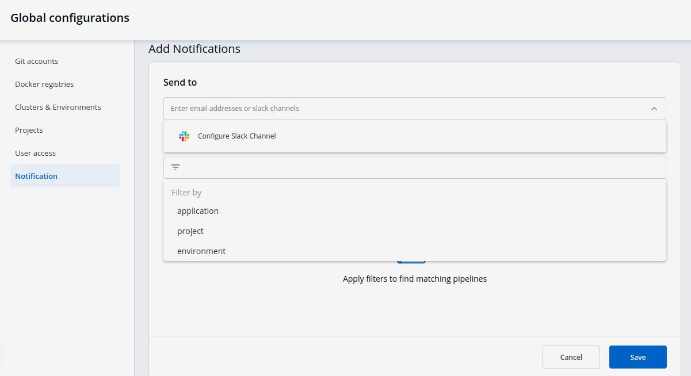
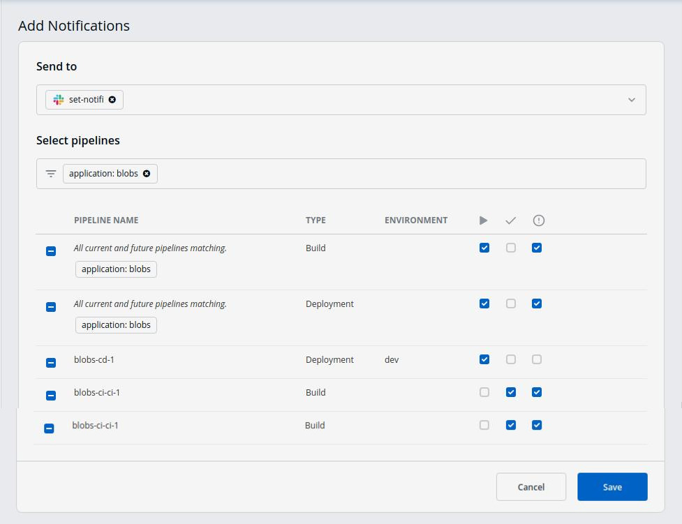
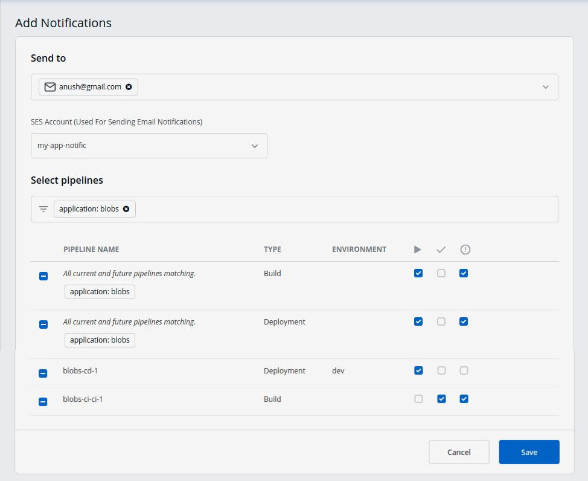

# Notification Channels

### **Manage Notifications**

Click on `Add New` to recieve new notification.

#### **Manage Slack Notifications**

_**Send To**_

When you click on the `Send to` box, a drop-down will appear, select your slack channel name if you have already configured Slack Channel. If you have not yet configured the Slack Channel, Click on [Configure Slack Channel](manage-notification.md#manage-slack-configurations)

_**Select Pipelines**_

* Then, to fetch pipelines of an application, project and environment.
  * Choose a filter type\(`environment`, `project` or `application`\)
  * You will see a list of pipelines corresponding to your selected filter type, you can select any number of pipelines. For each pipeline, there are 3 types of events `Trigger`, `Success`, and `Failure`. Click on the checkboxes for the events, on which you want to receive notifications.

Click on `Save` when you are done with your Slack notification configuration.

#### **Manage SES Notifications**

_**Send To**_

* Click on the Send To box, select your e-mail address/addresses on which you want to send e-mail notifications. Make sure e-mail id are SES Verified.

If you have not yet configured SES, Click on [Configure SES](manage-notification.md#manage-ses-notifications)

_**Select Pipelines**_

* To fetch pipelines of an application, project and environment.
  * Choose a filter type\(environment, project or application\)
  * You will see a list of pipelines corresponding to your selected filter type, you can select any number of pipelines. For each pipeline, there are 3 types of events `Trigger`, `Success`, and `Failure`. Click on the checkboxes for the events, on which you want to receive notifications.

Click on `Save` once you have configured the e-mail notification.
