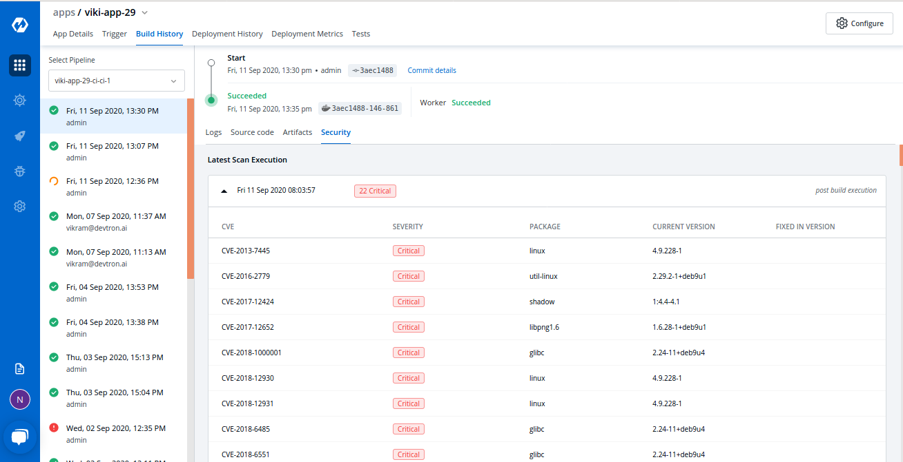
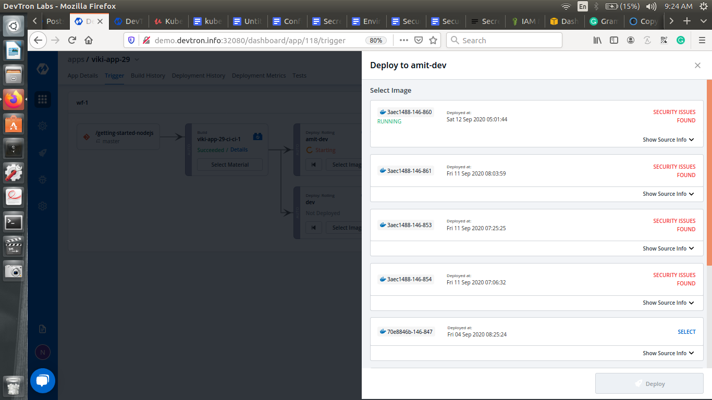
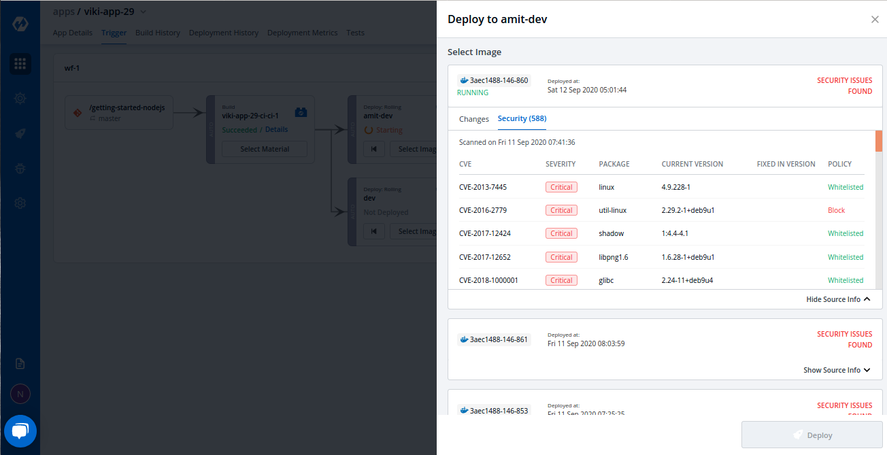
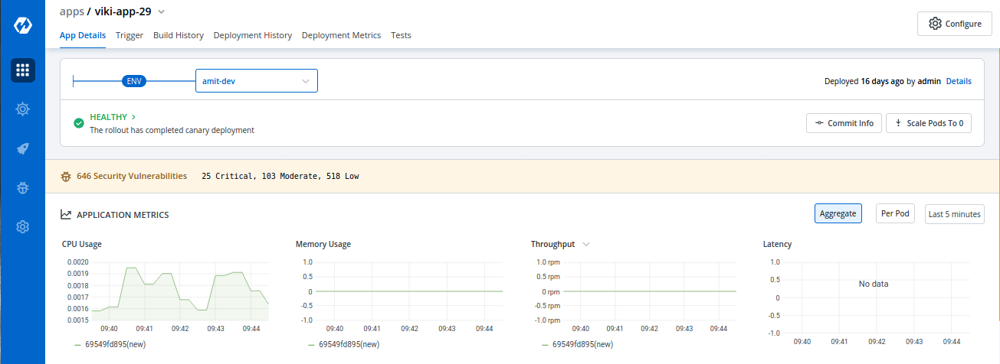
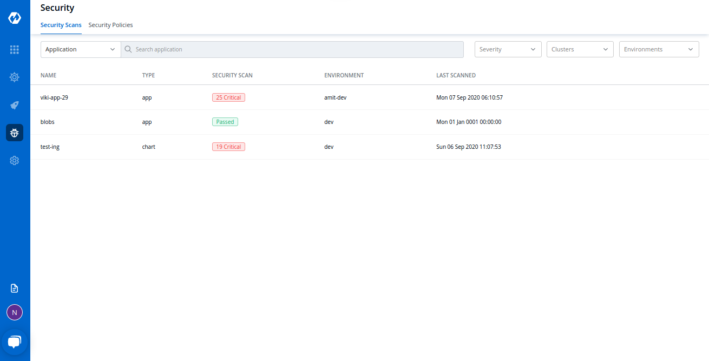
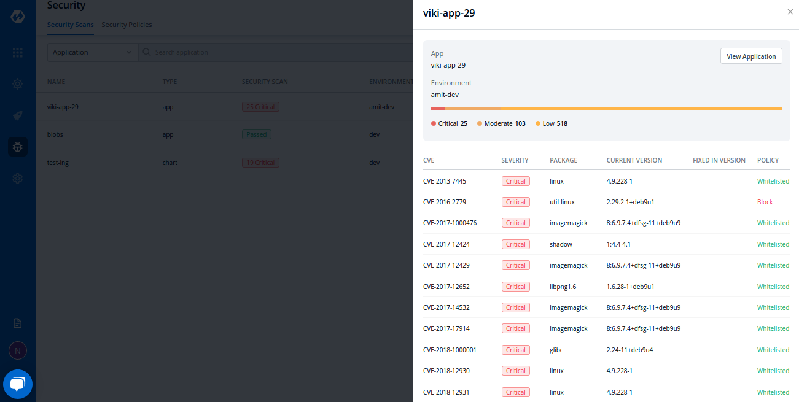
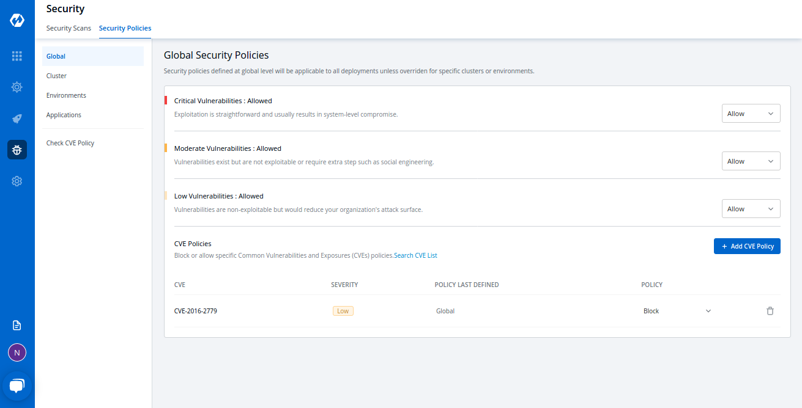
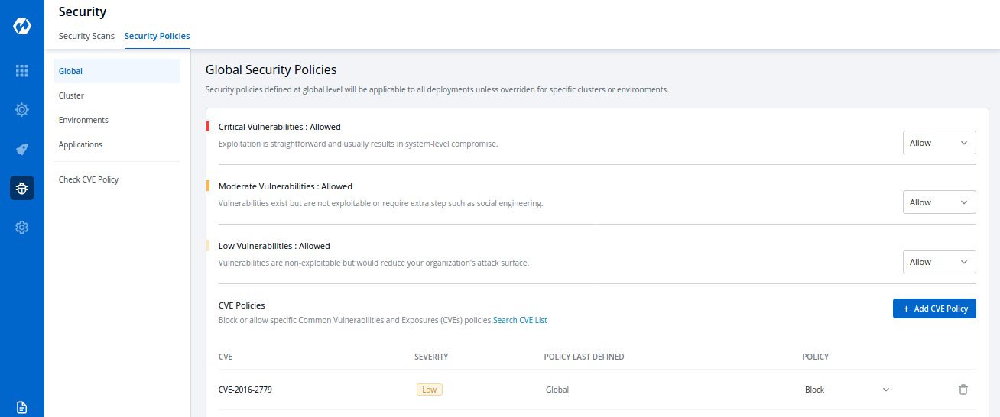

# Security Features

Devtron’s tool is also providing you `Security Features` to identify the vulnerabilities inside your code and to protect your code from external attacks.

The system will scan your code and inform you if there are any Vulnerabilities present in your code. Also to make this feature more flexible to use, we have added a capability using which you can whitelist or block any vulnerability, and your code will be scanned considering the defined whitelist or blocked vulnerabilities.

Remember, we discussed the `Scan for vulnerabilities` option in the CI pipeline. You can enable this feature from the CI Pipeline page. The system will scan your code and will show you all vulnerabilities present in your code.

We have created `Security features` to identify the vulnerabilities inside your code and to protect you from external attacks.

This Security Feature has two processes:

1. Scanning
2. Policy

### Scanning

This process starts executing after the successful execution of the CI pipeline and before the deployment\(CD\) process starts.

It scans your code to find any potential threat and shows you the list of vulnerabilities as an output of the CI pipeline if it finds any.

We will discuss later how you will see the list of your found vulnerabilities.

### Policy

Vulnerabilities have different levels like Critical, Moderate, and Low. Users can define policy according to the level of vulnerability. Users can also block the vulnerability or allow\(whitelist\) the vulnerability for their code.

If any vulnerability is found which is blocked by the user, then it will not deploy the application. And if it finds any vulnerability which is whitelisted by the user, then the build image can be deployed.

The user gets informed in both cases if it finds any vulnerability or doesn't find any.

**How to Check Vulnerability**

You can find the Vulnerabilities `Build History` Page if you have enabled the `Scan for vulnerabilities` option.

Your Application-&gt; Build History-&gt; Select pipeline-&gt; Go to Security Tab.

Here you can see all the vulnerabilities found in the build image.

Every vulnerability has `CVE ID`, `Severity Level`, Package, Current Version, and Fixed In Version.

**CVE ID**- Common Vulnerability ID

**Severity Level**- informs you about the severity of the vulnerability, it is defined as Critical, Medium, and Low.

**Package**- column contains some meta-data of vulnerability.

**Current Version**- is the version of that vulnerability

**Fixed In Version**- column contains version name if it has been fixed in any version, else it remains blank

**Find Vulnerabilities on the Trigger Page**

You can find Vulnerabilities on the `Trigger` page also. Image having vulnerabilities will be marked as `Security Issues Found` and you won’t be able to select the image to deploy it.

You can see details of these vulnerabilities by expanding the `Show Source Info`.

See the below image.

Click on the `Show Source Info` option. A window will be expanded with two options- Changes and Security. Click on the Security tab to view details about the vulnerabilities in the code.

**Find Vulnerabilities on the App Details Page**

You can find Vulnerabilities on the `App Details` page too. Here we are displaying the total number of vulnerabilities found in the code and their Severity Level wise segregation.

### Security

You can check Vulnerabilities for all your applications in one place. On the Home page, there is an option named `Security`. Here, you can see a list of applications under the `Security Scan` tab. Here all the applications are listed which have the `Scan for Vulnerabilities` feature enabled. You can see the vulnerability count along with the Severity Level for all your applications.

**Note:-**

It displays the “Vulnerability count and Severity Level” on a priority basis. And critical level has the highest priority, so it displays the critical level vulnerabilities and there counts if any application is having critical Vulnerability in it.

You can directly `Search` your application using the Search bar or you can `filter out` your requirement according to Severity, Clusters, and Environment.

Now if you click on the severity level of vulnerability it will show you the list of all vulnerabilities along with other details.

### Security Policies:

Users can define Security policies for their vulnerabilities under `Security Policies` Tab.

Home Page-&gt; Security - &gt; Security Policies

Policies can be defined to different levels-

* Global
* Cluster
* Environment
* Application

**Note:-**

Policies work in hierarchical order.

Order to be followed- First Global and second Cluster and so on as you can see the order of the options

**Some examples of how policies can be defined**

Users can block all the critical vulnerabilities and allow the moderate and low vulnerabilities or Users can block all vulnerabilities or users can block all vulnerabilities for one application and can block only Critical vulnerabilities for other applications.

### Configure Global Policy

To configure these policies, click on the drop-down option of the severity levels and select Block or Allow.

### Configure Cluster Security Policy

In the Global Security Policies, there are only two options available- Block and Allow. But in other options, we have an extra option named `Inherit`.

As the name itself gives you an idea about this option, it fetches the policy of its upper-level options, if we choose to inherit in the drop-down.

Example-if you block critical severity levels in Global, then critical levels will be blocked in Cluster Security Policy. In case we change critical policy globally and allow it there, then it will be allowed in Cluster Security Policies too. But you can change these policies explicitly.

If you want to block Critical Vulnerabilities in Global Security Policies but want to allow them in some clusters, then select your cluster and change the critical drop-down to allow. It will not affect the policy of other clusters and global also.

### Configure Environment Security Policy

Again we have three options to define a policy- Block, Allow, and Inherit.

Environment Security Policy inherits the policy from Cluster Security Policy. Each level inherits the policy of its upper level.

Select any environment here, you will find it is inheriting the policy of Cluster.

Example- If you have blocked critical level vulnerabilities in Global Security Policy but allowed them in Cluster Security Policy, then Environment Security Policy will inherit the policy of cluster not global, Hence critical level vulnerabilities will be allowed in the Environment Security Policy.

Though, You can change the policy explicitly.

### Configure Application Security Policy

The same thing goes with the `Application Security Policy`. But in Application, the policy is set with the combination of `Environment` option and `Application` option. If you change the policy in a dev environment that it will apply to all the applications which are in the `dev` environment.

### Check CVE Policy

Here is the last option `Check CVE Policy`, If you want to configure a security policy specific to any Vulnerability, you can use this option.

Click on this option, it will show you a search bar, copy any CVE ID or vulnerability ID, and click on `Search`. It will display the details regarding that CVE ID and you can configure the policy to that particular CVE ID.

