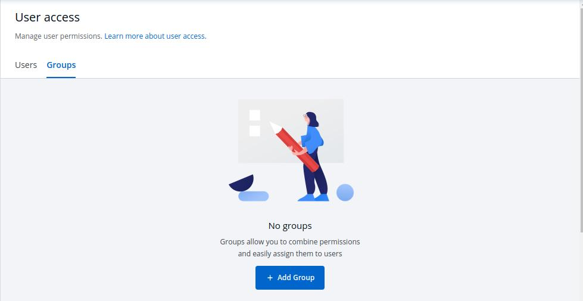
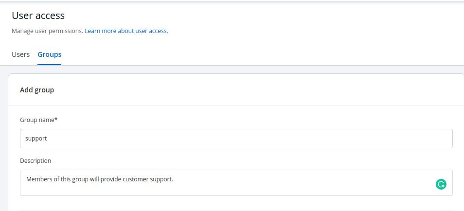
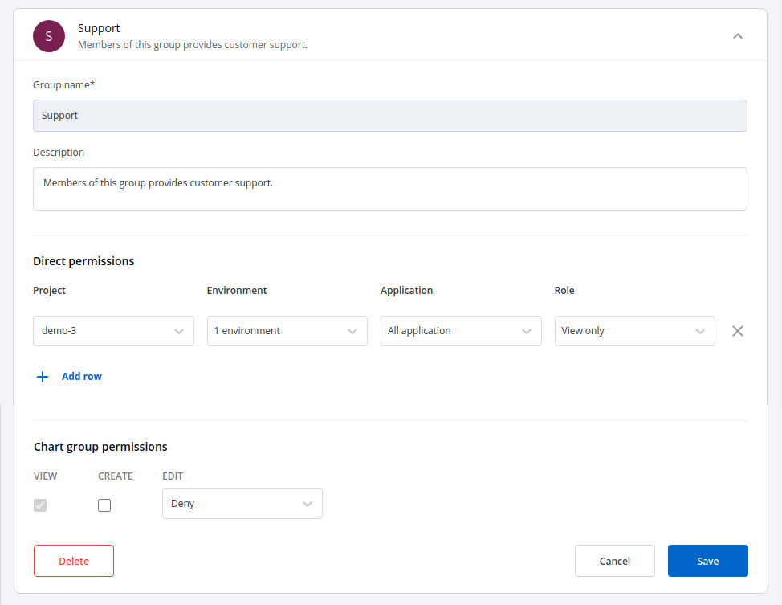

# Group permissions

### Groups

The advantage of the groups is to define a set of privileges like create, edit, or delete for the given set of resources that can be shared among the users within the group. Users can be added to an existing group to utilize the privileges that it grants. You can select the group which you are creating in the `Group permissions` section inside `Add users`.

#### 1. Add new Group

Click on `Add Group`, to create a new group.

Enter the `Group Name` and `Description`.

#### 2. Create Group Permissions

Once you have given the group name and group description.

Then, control the access permissions of groups in the Direct Permissions section. Manage the Project, Environment, Application, and Role access the same as we discuss in the above users section.

You can add multiple rows, for the Direct Permissions section.

Once you have finished assigning the appropriate permissions for the listed users, Click on `Save`.

#### 3. Edit Group Permissions

You can edit the group permissions, by clicking on the `downward arrow.`

Then you can edit the user permissions here.

Once you are done editing the group permissions. Click on `Save`.

If you want to delete the groups with particular permissions. Click on `Delete`.

#### 4. Manage Chart Group Permissions

The chart group permissions for the group will be managed in the same way as for the users. For reference, check Manage chart group permissions for users.
