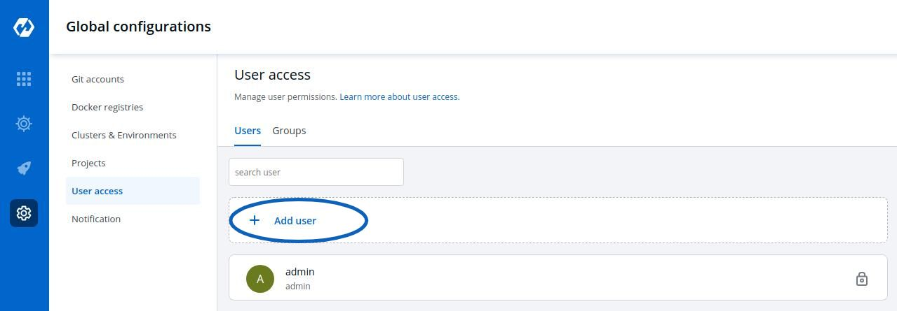

# Manage users



Authorization is used to determine what functions, data, or other parts of an application the user or the group should have access to.

You can manage the User and Group access to Projects, Applications, Chart Groups, Environments, and Roles using the User Access feature.

To control the access of User and Group-

Go to the left main panel -> `Select Global Configurations` -> Select `User Access`

### Users

#### 1. Add new user

Click on `Add User`, to add one or multiple users.

#### 2. Create User Permissions

When you click on Add User, you will see 5 options to set permission for users which are as follow:

* Email addresses
* Assign super admin permissions
* Group permissions
* Direct permissions
  * Project
  * Environment
  * Applications
  * Roles
* Chart group permissions

### Email addresses:

In the `Email address` box, you have to provide the mail ID of the user to whom you want to give access to your applications.

#### Assign super admin permissions

If you check the option `Assign super admin permissions`, the user will get full access to your system and the rest of the options will disappear. The user with super admin permission can do anything whatever the user wants to do.

Click on `Save` and your user will be saved with super admin permissions.

If you don’t want to assign super admin permissions then you have to provide the rest of the information.

#### Group permissions

The Group permissions section contains a drop-down of your created groups. This is optional. We will discuss how to create groups in the later section.

#### Direct permissions

If you do not want to give the users super admin permissions, then control their access in the `Direct Permissions` section. In this section, you will see 4 options to manage the permissions of your users.

* **Project**

Select a project from the drop-down to which you want to give permission to the users. You can select only one project at a time if you want to select more than one project then click `Add row`.

* **Environment**

In the `Environment` section, you can select one or more than one or all environments at a time. Click on the environment section, you will see a drop-down of your environments and select any environment on which you want to give permission to the user.

* **Applications**

Similarly, you can select `Applications` from the drop-down corresponding to your selected Environments. In this section, you can also give permissions to one or more than one or to all applications at a time.

* **Roles**

  Inside the `Role`, you actuallyhoose which type of permissions you want to give to the users.

  There are four different view access levels/Role available for both User and Group, namely:

  * **View Only**: User\(s\)/Group\(s\) can only view the selected applications.
  * **Build and Deploy**: User\(s\)/Group\(s\) under build & deploy also have `View Only` permissions but apart from the view only permission they have the permission to trigger CI/CD pipelines of the applications of selected environments.
  * **Admin**: User\(s\)/Group\(s\) who have `Admin` permission can view, trigger, and edit selected applications.
  * **Manager**: User\(s\)/Group\(s\) under manager also have the `Admin` permissions but apart from that they can create, edit, and delete the selected applications, can also manage `User access` but the user can only give permissions on those applications which the user has access to.

You can add multiple rows, for Direct Permissions.

Once you have finished assigning the appropriate permissions for the listed users, Click on `Save`.

Chart group permissions

You can also manage the access of users to Chart Groups in your project. This is optional, if you want to give permission regarding your helm charts in that case you can use it. By default, all users have the `View` permission of the charts.

You can either give the users permission to `Create` or `Edit`.

Click on the checkbox of `Create`, if you want the users to create, view, edit, or delete all the chart groups.

Click on the checkbox of `Edit`, if you want to `allow` or `deny` users to edit the chart groups.

Select on `Deny` option from the drop-down menu, if you want to restrict the users to edit the chart groups.

Select the `Specific Charts` option from the drop-down menu, and then select the chart groups for which you want to allow users to edit, from the other drop-down menu.

Click on `Save`, once you have configured all the required permissions for the users.

#### 3. Edit User Permissions

You can edit the user permissions, by clicking on the `downward arrow`.

Then you can edit the user permissions here.

After you have done editing the user permissions. Click on `Save`.

If you want to delete the user/users with particular permissions. Click on `Delete`.

