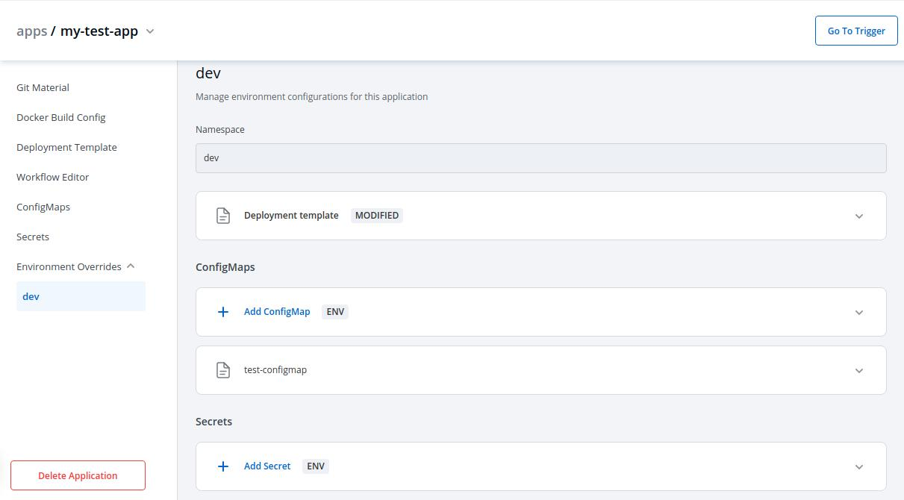

# Environment Overrides

You will see all your environments associated with an application under the `Environment Overrides` section.

You can customize the `Deployment template, ConfigMap, Secrets` in Environment Overrides section to customize things according to multiple environments such as dev, test, integration, prod, etc.

## Deployment template

If you want to deploy an application in a non-production environment and then in production env once testing is done in non-prod env, then you do not have to create a new application for prod env. Your existing pipeline\(non-prod env\) will work for both the environments with little customization in your deployment template under `Environment overrides`.

### Example of such customization requirement:

In a Non-production environment, you may have specified 100m CPU resources in the deployment template but in the Production environment you may want to have 500m CPU resources as the traffic on Pods will be higher than traffic on non-prod env.

Configuring the Deployment template inside `Environment overrides` will not affect the other environments because `Environment Overrides` configure deployment template on environment bases. And at the time of deployment, it will always pick the overridden deployment template.

The changed configuration will not be added to the template, instead, it will make a copy of the template and lets you customize it, and then save it. And now this overridden template will be used for your other Environment.

Click on `Allow Override` and make changes to your Deployment template and click on `Save` to save your changes of the Deployment template.

### ConfigMaps & Secrets

The same goes for `ConfigMap` and `Secrets`. You can also create an environment-specific configmap and Secrets inside the `Environment override` section.

If you want to configure your ConfigMap and secrets at the application level then you can provide them in [ConfigMaps](config-maps.md) and [Secrets](secrets.md), but if you want to have environment-specific ConfigMap and secrets then provide them under the Environment override Section. At the time of deployment, it will pick both of them and provide them inside your cluster.

Click on `Update ConfigMap` to update Configmaps.

Click on `Update Secrets` to update Secrets.

