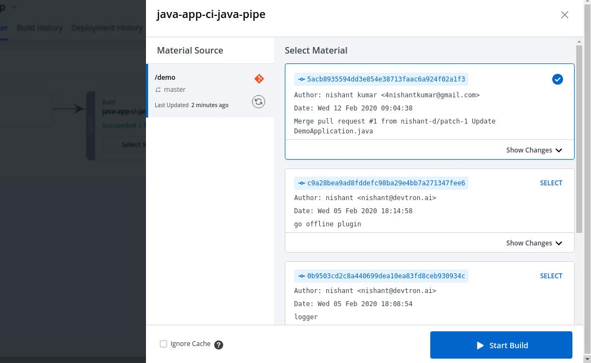

# Triggering CI

## Triggering CI Pipelines

The CI Pipeline can be triggered by selecting **Select Material**

CI Pipelines that are set as Automatic are always triggered as soon as a new commit is made to the git branch they're sensing. However, CI Pipelines can always be manually triggered as and if required.

Various commits done in the repository can be seen, here along with details like Author, Date etc. Select the commit that you want to trigger and then select "Start Build" to trigger the CI Pipeline.

**Refresh** icon, refreshes Git Commits in the CI Pipeline and fetches the latest commits from the “Repository”

**Ignore Cache** : This option will ignore the previous build cache and create a fresh build. If selected, will take a longer build time than usual.

It can be seen that the pipeline is triggered here and is the _Running_ state.

Click on your **CI Pipeline** or Click on **Build History** to get the details about the CI Pipeline such as logs, reports etc.

You can read the **logs** of the CI Pipeline from here.

Click on **Source code** to view the details such as commit id, Author and commit message of the Git Material that you have selected for the build.

Click on `Artifacts` to download the _reports_ of the Pre-CI and Post-CI stages if any.

