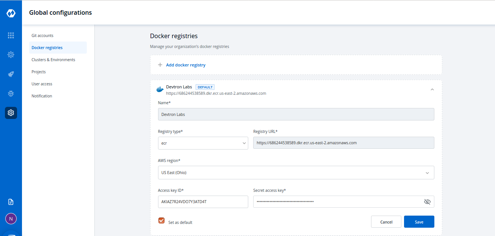
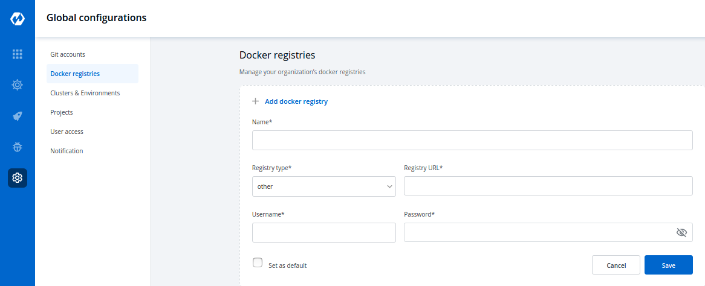

# Docker Registries

The global configuration helps you add your `Docker Registry`. In the Docker registry, you provide credentials of your registry, where your images will be stored. And this will be shown to you as a drop-down on `Docker Build Config` Page.

## Add Docker Registry configuration:

Go to the `Docker Registry` section of `Global Configuration`. Click on `Add docker registry`.

You will see below the input fields to configure the docker registry.

* Name
* Registry type
  * Ecr
    * AWS region
    * Access key ID
    * Secret access key
  * Others
    * Username
    * password
* Registry URL
* Set as default

### Name

Provide a name to your registry, this name will be shown to you in Docker Build Config as a drop-down.

### Registry type

Here you can select the type of the Registry. We are supporting two types- `ecr` and `others`. You can select any one of them from the drop-down. By default, this value is `ecr`. If you select ecr then you have to provide some information like- `AWS region, Access Key, and Secret Key`. And if you select others then you have to provide the `Username` and `Password`.

### Registry URL

Select any type of Registry from the drop-down, you have to provide the URL of your registry. Create your registry and provide the URL of that registry in the URL box.

### Registry Type- ECR:

You have to provide the below information if you select the registry type as ECR.

* **AWS region**

Select your AWS region from the drop-down, region where you have created your registry in.

* **Access key ID**

Inside the Access key ID box, provide your AWS access key.

* **Secret access key**

Provide your AWS secret access key ID.

### Registry Type Others:

You have to provide the below information if you select the registry type as others.

* **Username**

Give the username of your account, where you have created your registry in.

* **Password**

Give the password corresponding to the username of your registry.

### Set as default:

If you enable the `Set as default` option, then this registry name will be set as default in the `Docker Registry` section inside the `Docker build config` page. This is optional. You can keep it disabled.

Now click on `Save` to save the configuration of the `Docker registry`.

